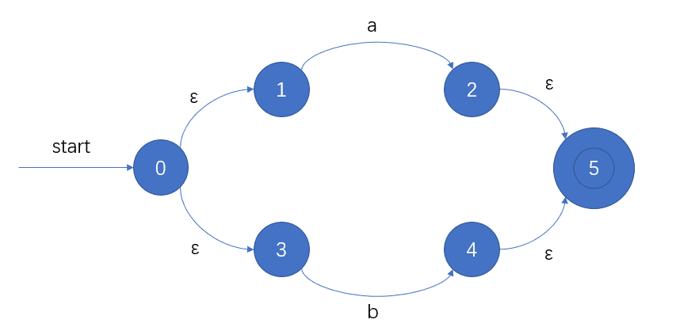
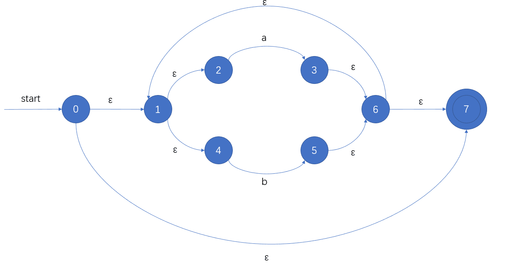

### 编译系统
编译系统由四部分构成:
预处理器，编译器，汇编器，链接器

##### 预处理器
delete comments, include other files, perform macro substitutions.

##### 编译器
A language translator. It executes the source program immediately. Depending on the 
language in use and the situation 

◆Assemblers
A translator translates assembly language into object code
◆Linkers
Collects code separately compiled or assembled in different object files into a file.
Connects the code for standard library functions.
Connects resources supplied by the operating system of the computer.

分析/前端负责知道高级语言，综合/后端负责生成机器语言

lexical analyzer词法分析器 负责看懂单词,让机器知道什么是单词。唯一接触源语言的。把标识符信息放入符号表。
syntax analyzer 语法分析器 创造语义结构，创建了语法树，用上下文无关文法检查单词结构，判断句子语病。判断句子是否合法。
semantic analyzer 建立高级语言到机器语言的映射

正则表达式是上下文无关文法的子集。

A token （单词）describes a pattern of characters having some meaning in the source program. (such as identifiers, operators, keywords, numbers, delimeters and so on)

### 单词四要素

单词token: identifier的名字。字符串公共集合的分类。scanner中的逻辑单元。
比如 \<Identifier\>, \<number\>。

规则pattern：描述单词字符串集合
比如Recall File and OS Wildcards ([A-Z]*. *)

词素lexeme：例子。符合模式且被单词分类的字符的实际序列。lexeme是token的实例。pattern是lexeme的集合。
比如 x,i,name

属性attribute:单词中除了词素外的信息
语义规则表示属性的依赖关系
词法分析器不需要知道属性，属性等到语义分析才需要。

单词影响parsing decision，属性影响单词翻译。
正则表达式是单词的一种规则

#### 语言相关
语言是固定字母表上的字符串集合。
字母表是符号的有限集合。
字符串是确定顺序的符号
> 有限确定自动机不允许有空  
> $\empty$ 表示空语言
> {$\epsilon$} 表示空串组成的集合

把有限算子扩充成无限语言的方法——结构归纳法
正则表达式就是结构归纳法定义的。

### 后缀表达式

#### 中缀转后缀
建立符号栈
顺序扫描中缀表达式
a） 数字直接输出
b） 是运算符
i : “(” 直接入栈
ii : “)” 将符号栈中的元素依次出栈并输出, 直到 “(“, “(“只出栈, 不输出
iii:  从栈顶开始把比当前符号优先级高的符号都出栈。将当前符号入栈。
扫描完后, 将栈中剩余符号依次输出

#### 后缀到中缀
顺序扫描后缀表达式
将数字压栈，如果遇到操作符，就弹出两个数字。与运算符构成一个算式，作为一个整体再次压入栈。
以此类推。

## 从RE到DFA

不确定性：
1.可以什么都不做就到达下一个状态
2.可以在相同动作下到达不同的状态

可以采用状态迁移图和状态迁移表表示，但图需要start和双圆圈；表需要标注start state和final state

DFA中不允许 $\epsilon \  move$
$S×\sum→S$
### RE → NFA → DFA
RE → NFA 汤普森构造法
NFA → DFA 子集构造法

<table>
<th>
    <td>空间复杂度</td>
    <td>时间复杂度</td>
</th>
<tr>
    <td>NFA</td>
    <td>O(正则表达式长度)</td>
    <td>O(正则表达式长度*输入长度)</td>
</tr>
<tr>
    <td>DFA</td>
    <td>O(2^正则表达式长度)</td>
    <td>O(输入长度)</td>
</tr>
</table>

#### 汤普森构造法
按照定式拼接
a|b

(a|b)*

#### 子集构造法：

$$
\epsilon - closure(num)表示从num状态经过\epsilon可到达的状态 \\
1.从起始状态开始，找到起始状态经过\epsilon 可到达的所有状态记作S_0。 \\ 
2.对于其中的一个转移字符char，求\epsilon - closure(move(S_0,char))，表示对S_0中所有状态进行char字符的迁移能够得到的状态得到\epsilon - closure(num_1,num_2,...) \\
3.求出\epsilon - closure(num_1,num_2,...)的结果，如果与之前的S_0不同，则记作S_1 \\
4.对每个转移字符char都求\epsilon - closure(move(S_0,char))，得到S_2,S_3,... \\
5.对所有S_i进行2，3，4操作，直到没有新的S_i出现。
6.把所有的S_i构造状态迁移表，S_i作列头，转移字符作行头
$$

### RE → DFA
#### 直接构造法
内部节点都是算子

$$
1.把正则表达式加上\#。 \\
2.把非空字符按顺序做索引1，2，3... \\
3.构建树 \\
4.对所有的索引index都计算followpos(index) \\
5.把firstpos(root)作为S_0 \\ 
6.对所有在S_0字符char，followpos(char)，若有相同则求并集得到S_1,S_2,... \\
7.对S_1,S_2,...采用第6步，直到没有新状态为止。
$$

followpos：followpos(num)表示num代表的字符后面可接的字符的索引。
firstpos(root)表示可以直接达到的索引

◆ firstpos(n) -- the set of the positions of the first symbols of strings generated by the sub-expression rooted by n.
◆ lastpos(n) -- the set of the positions of the last symbols of strings generated by the sub-expression rooted by n.
◆ nullable(n) -- true if the empty string is a member of strings generated by the sub-expression rooted by n.

#### 最小化DFA
1.先把所有状态看作状态G，G1表示可以接受的状态（可终止状态），G2表示不可接受的状态。
2.根据识别字母能否区别其他状态来区分，若多个状态输入相同字母都进行相同操作则看作一个状态。

### 上下文无关文法
语法解析的基础。

特征：
– 一个有限的终结符集合
– 一个有限的非终结符集合
– 一个有限的产生式集合（且所有产生式左边只有一个非终结符，也没有终结符，右边是终结符，非终结符，空串的组合）
– 一个非终结符作为起始符 

产生式：
需要把|的都分开算，并不是一行算一个。
非终结符：出现在箭头左边的。
终结符：除了终结符之外的。

可以由上下文无关文法产生的语言叫上下文无关语言。

parser工作在单词流上。
最小项就是单词.

### 句子、句型、句柄区别

* 句子
  箭头右边全部是由终结符组成的字符串。
* 句型
箭头右边如果有非终结符，则是句型。句子是没有非终结符的句型。
* 句柄
句子中一个符合产生式右边的子串。被推导规约的那个。
但不是所有符合产生式右边的字串都是句柄。
如果语法没有二义性，那么每个语法的右句型都有且只有一个句柄

等价语法：两个语法能产生相同的语言

## 文法概念
二义性      不确定性 无法解决
左递归      无法终止 可以解决
左因式分解   不确定性 可以解决

### 最左推导与最右推导
如果每次推导的过程中都替换最左边的非终结符，就是最左推导。
如果每次推导的过程中都替换最右边的非终结符，就是最右推导。
top-down用最左推导，bottom-up用最右推导。

### 二义性
二义性：有两种不同的最左推导或两种不同的最右推导。
二义性无法确定，所以在现实中不判断！
注意，有两种推导不一定有二义性。

#### 消除二义性
消除二义性的方法：规定优先级
规定优先级的方法：替换变量
E → E+E | E*E | E^E | id 
比如这个，将每一个推导式的最后一个相同变量替换成新变量并且可以推出它，并作为新推导的非终结符。
可转换为
E → E+F | F
F → F*G | G
G → G^H | H
H → id 

### 左递归
语法中有形如A → Aα这样的就是左递归。如果一步里直接有A → Aα，称为直接左递归。
top-down语法分析器无法处理左递归

#### 解决左递归
##### 直接左递归
对于A → Aα | β这样的直接左递归，
$$
A → Aα | β \\
转化为 \\
A → βA' \\
A' → αA' | \epsilon
$$
更泛化的情况
$$
A → Aα_1 | ... | A α_m | β_1 | ... | β_n \\
转化为 \\
A → β_1 A’ | ... | β_n A’ \\
A’ → α_1 A’ | ... | α_m A’ | \epsilon 
$$

##### 非直接左递归
对所有非终结符A1,A2,...An
把Ai → Aj α(i>=j)中的Aj全部替换。(即把出现在之前的右边的非终结符全部替换掉)
然后采用直接左递归的方式解决。

### 左因式分解
一个可预测的语法分析器（top-down且没有回溯）要求语法左因式分解。当有大于一个推导可以用于扩展非终结符时，我们需要等到能判断时再判断。

#### 解决左因式分解
提取公共左因子。
比如
$$
A → αβ_1 | αβ_2 \\
转化为 \\
A → αA' \\
A' → β_1 | β_2
$$
更泛化的情况
$$
A → αβ_1 |...| αβ_m | γ_1 |...| γ_n \\
转化为 \\
A → αA'  | ... | γ_1 |...|γ_n  \\
A' → β_1 | ... | β_m  
$$

# 自顶向下语法分析
语法树是自顶向下创建的。
有两种做法
递归下降
* 不高效
  
可预测分析
* 高效
* 无回溯
* 存在递归可预测分析，是递归下降中没有回溯的一种特殊形式
* 无递归的可预测分析也叫LL1分析

### 递归下降方式
利用最左推导画语法树，如果发现不符合规则则回溯。

## LL1分析
LL1分析有输入buffer，栈，分析表，输出流
第一个L表示从左至右扫描，第二个L表示最左推导，1表示指针1次指向一个字符。

### 性质
无二义性
无左递归
无公共左因子
LL1语法等价于 当 A → α|β时，
1. α & β 无法推导出以相同终结符起始的字符串
2. a,b不能同时推出 $\epsilon$
   

### LL1分析过程
解析过程中，先往栈里放入结束符\$和开始符，在输入字符串末加上\$。
对于栈顶元素X 和现在解析的输入字符a 来说
1. 当 X=a=$ 停止并接受，成功解析。
2. 当 X=a ≠ $ ,把X弹出栈，进入下一个输入字符.
3. 当 X 是非终结符,检查分析表 M[X,a]。如果是错误，则进入错误处理；如果 M[X,a] = {X → UVW}, 那么弹出 X, 把W,V,U依次压入栈（==注意此处的压栈顺序是反的！==）

画出三列stack,input,output
stack里是$和初始符，把给定的input抄入input，在解析过程中如果用到推导，则在output里写上推导。

### FIRST集与FOLLOW集

==在求之前，先要解决左递归！==

#### FIRST集求法

对于A → αBβ，求FIRST(A)

0.对于非终结符，那么FIRST(id)={id}

1.如果A → $\epsilon$，那么把$\epsilon$加入FIRST(A)

2.如果推导右边第一个是终结符（即α存在），那么把该终结符α加入FIRST(A)。

3.如果推导右边第一个是非终结符（即α不存在），那么FIRST(A)=FIRST(B)。如果B能推出$\epsilon$，那么还要并上第二个符号的FIRST集（即并上FIRST(β)），并以此类推。

#### FOLLOW集求法

1.先把$加入起始符的FOLLOW集中。

2.对于一个式子A→αBβ，除了$\epsilon$外所有在FIRST(β)里的东西都在FOLLOW(B)里。

3.如果FIRST(β)里有$\epsilon$或者β不存在，那么所有在FOLLOW(A)里的东西都在FOLLOW(B)里。

### 构造LL1分析表

1.先求出FIRST和FOLLOW集

2.如果终结符a在FIRST(α)中，第A行α列为A→α

3.如果$\epsilon$在FIRST(α)中，那么把A→α加入第A行b列（b为FOLLOW(A)中所有终结符）。如果$在FOLLOW(A)中，那么把A→α加入第A行\$列

如果表里单元格出现两个或以上产生式且已经做过预处理，那么就是二义性导致。

#### 判断是否是LL1文法

1.先看有无左递归。若有则不是。

2.再看有无二义性，若有则不是。

3.构造LL1语法分析表，若有冲突则不是。

# 自底向上语法解析
bottom-up parse也称为shift-reduce parse

shift:移入。把下一个输入符号移入栈顶。
reduce:规约。把栈顶句柄用非终结符替代。
在分析过程中，如果栈顶可以规约，那就替代；否则把新元素压栈。

内核项：包括S'→.S以及点不在最左端的所有项。

非内核项：除了S'→.S之外点在最左端的所有项。

LR(k)文法
L表示从左至右扫描
R表示最右推导
k表示向前看几个

## SLR文法

### SLR分析过程
解析过程中，先往栈里放入开始符0，在输入字符串末加入$。
对于栈顶元素{X,state} 和现在解析的输入字符a 来说
1. 先去找actionTable[state,a]，然后把栈顶元素弹出。
2. 如果是s newState,那么把{a,newState}压入栈，input指向下一个元素；如果是r number，那么找到对应的规约表达式（一般就是number序号对应的规约式），得到这个规约式的箭头左边A。然后再找到此时的栈顶元素{X',state'}。在gotoTable[state,A]中找到newState，把{A,newState}压入栈。
3. 如果actionTable中没有，则报错。

画出四列stack,input,action,output
stack里一开始是0，把给定的input抄入input，在action里记录每步发生的操作。在解析过程中如果用到规约，则在output里写上规约式。

### 构造SLR分析表

先增加一个产生式S'→S

#### 闭包求法closure operation

1.先加入自己

2.把将要分析的（即.右边的）非终结符作为推导左边的推导加入闭包，重复该步骤直到没有新的推导加入

#### 构建集族

1.把所有|拆成几个推导式

2.I0是S'→S的闭包，并在所有的推导右侧加上.

3.移动.遍历推导，通过字符不同走向不同状态

4.遍历过程中如果.移动到了非终结符前，则需要加入该非终结符推导的闭包。

5.如果有重复状态，则只需要移动到旧状态即可。

#### 根据集族构造goto table

1.看所有转移为非终结符的转移，从状态i通过非终结符A转移到状态j，则goto第i行列A为j

#### 根据集族构造action table

1.看所有转移为终结符的转移，如果从状态i通过终结符a转移到状态j，那么在action表第i行列a处为s j

2.如果状态i有.在推导最右的推导式x（x为序号），若该推导为S'→S，则在action表第i行列$处为acc；若为其他推导，则求该推导左边非终结符A的FOLLOW集FOLLOW(A)，在第i行FOLLOW(A)里所有列处为r x

#### 验证SLR文法

需要构造SLR语法分析表，如果没有冲突就是SLR文法，否则不是。

## LR1文法

### 构造LR1分析表

#### 闭包求法

1.对于S'→S，则向前看标志为$

2.对于A→BC，a    ，B→D，那么B→D的向前看标志为FIRST(Ca)。 这步需要慢做，尤其搞清楚谁是B！

3.输入字符移动时，向前看标志不变。

4.注意向前看标志不同，算不同闭包。有些

#### 根据集族构造goto table

1.看所有转移为非终结符的转移，从状态i通过非终结符A转移到状态j，则goto第i行列A为j

#### 根据集族构造action table

1.看所有转移为终结符的转移，如果从状态i通过终结符a转移到状态j，那么在action表第i行列a处为s j

2.如果状态i有.在推导最右的推导式x（x为序号），若该推导为S'→S，则在action表第i行列$处为acc；若为其他推导，则action表第i行列a处为r x

## LALR文法

同心核：

## 语法制导定义

### 继承属性和综合属性

如果语义规则里的属性是终结符的属性，那么一定是综合属性。

对于产生式A→BC，语义规则只有等号左边的属性才能进行判断。如果是A.prop=B.prop或A.prop=C.prop，那么A的prop为综合属性；否则是继承属性。

若语义规则 A.prop=B.prop，则A的prop为综合属性；若语义规则 B.prop=A.prop，则B的prop为综合属性；若语义规则 B.prop=A.prop，则B的prop为继承属性。即等号右边的变量不能是等号左边变量推导式中右边的变量。

属性文法

从base开始

# 运行时环境
编译器为了在目标机上支持抽象概念，创建并且管理着一个运行时环境。编译得到的目标程序就在这个环境中。这个环境处理很多事务，包括为源程序中命名的对象分配和安排存储位置，确定目标程序访问变量时使用的机制，过程间的连接，参数传递机制，以及与操作系统、输入输出设备及其他程序的接口。
编译器后端需要帮助计算。

#### 存储空间

编译程序为了组织存储空间，必须考虑下面几个问题：
➢ 过程是否允许递归？
➢ 当控制从一个过程的活动返回时，对局部名称的值如
何处理？
➢ 过程是否允许引用非局部名称？
➢ 过程调用时如何传递参数；过程是否可以做为参数被
传递和做为结果被返回？
➢ 存储空间可否在程序控制下进行动态分配？
➢ 存储空间是否必须显式地释放？

一个目标程序运行所需的存储空间包括:
➢存放目标代码的空间
➢存放数据项目的空间
➢存放程序运行的控制或连接数据所需单元(控制栈)

栈向较低地址方向生长，堆向较高地址方向生长。
静态和动态分别表示编译时刻和运行时刻。

#### 过程
过程是模块程序设计的主要手段，是节省程序代码和扩充语言的主要途径。
一个过程的活动：该过程的一次执行。
过程P一个活动的生存期(Lifetime)：从执行该过程体第
一步操作到最后一步操作之间的操作序，包括执行P时调用其它过程花费的时间。

过程调用和返回由一个称为控制栈的运行时刻栈进行管理。每个活动都有一个位于这个控制栈中的活动记录（也叫作帧）。活动记录记录着函数运行时各种信息和数据。运行时，每当进入一个过程就有一个相应的活动记录累筑于栈顶。

活动记录包含
* 临时单元、内情变量、局部变量
  局部变量、内情向量、临时工作单元（如存放对表达式求值的结果）。
* 形式单元
存放相应的实在参数的地址或值。
* 静态链
指向静态直接外层最新活动记录地址的指针，用来访问非局部数据。
* 动态链
指向调用该过程前的最新活动记录地址的指针。
* 返回地址

#### 传参方式
* 传值
把实在参数的值传递给相应的形式参数

* 传结果
传地址的一种变形

* 传地址
把实在参数的地址传递给相应的形式参数

* 传名
过程调用的作用相当于把被调用段的过程体抄到调用出现的地方，但把其中任一出现的形式参数都替换成相应的实参

# 中间代码生成
## 三地址代码
计算:
二元
x := y op z → op x,y,z
一元
x := op y → op x,,y

赋值:
x := y → mov x,,y

条件:
无条件跳转
jmp ,,L
goto L
有条件跳转
if x > y goto L  → jmpgt x,y,L
if x >= y goto L  → jmpge x,y,L
if x < y goto L  → jmplt x,y,L
if x <= y goto L  → jmple x,y,L
if x == y goto L  → jmpeq x,y,L
if x != y goto L  → jmpne x,y,L
if x == true goto L → jmpt x,,L
if x == false goto L → jmpf x,,L

函数
func(x1,x2,...,xn)
 → 
param x1,,
param x2,,
...
param xn,,
call func n

数组
x=arr[i] → mov x,,arr[i]

地址操作
x=&y → moveaddr x,,y
x=*y → movecont x,,y

复习

第1章，第3-6章重点
第7章 运行时环境怎么构造。需要的部分。设计的基本原则
第8章 如何参数传递？中间代码生成：三地址代码，三地址代码的应用

编译器与编译系统？
前端与后端？什么时候分前端后端？什么时候分词法语法？为什么呢

考试题型
选择，填空（核心概念）
简答（实施细节：预处理+小算法如解决左递归，找句柄，二义性等）
计算（九大算法+三地址代码）
